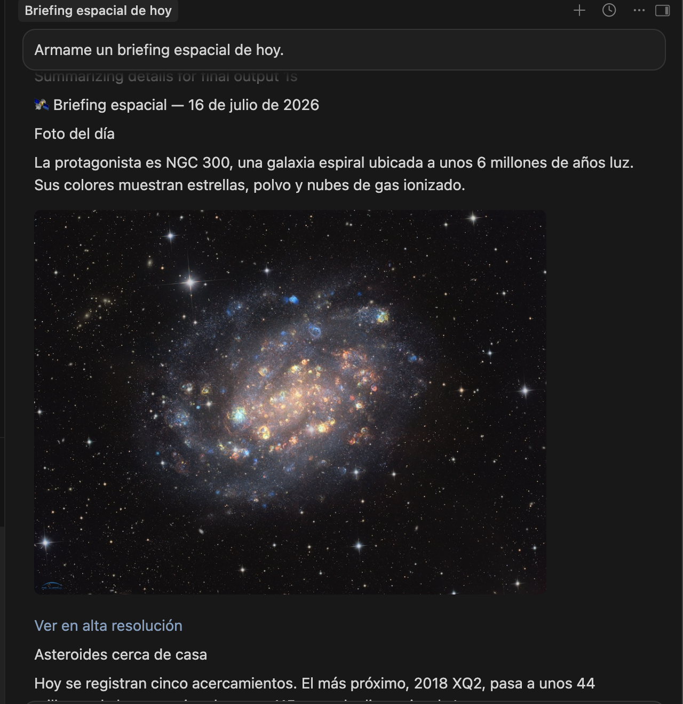
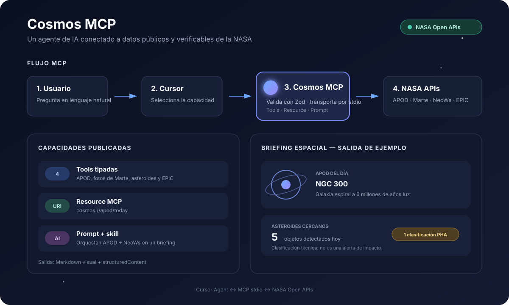
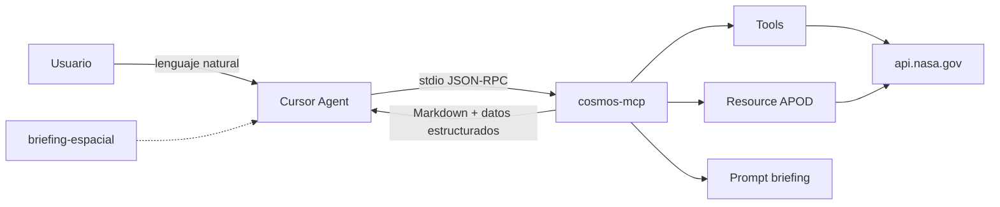
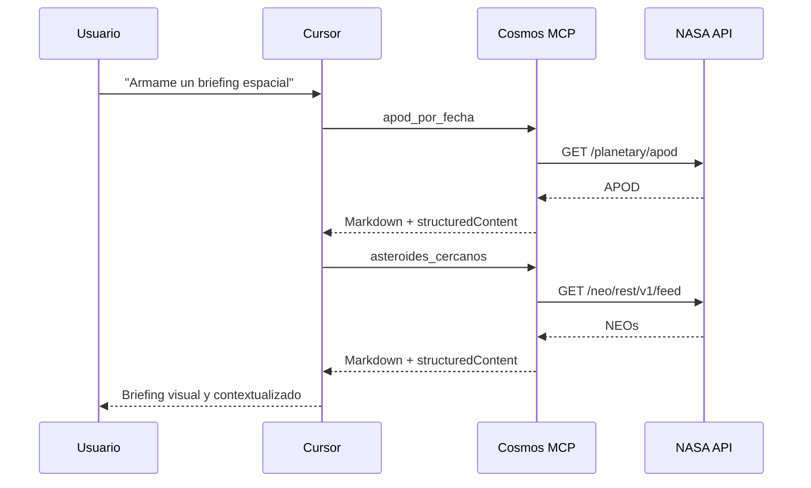

# cosmos-mcp

Servidor **MCP** (Model Context Protocol) en TypeScript que expone APIs públicas de la NASA para **Cursor**. Incluye tools, un resource, un prompt MCP y una skill propia (`briefing-espacial`), con respuestas visuales y demo reproducible.

## Demo

Pedile a Cursor `Armame un briefing espacial de hoy` y la skill combina la
imagen astronómica del día con los asteroides cercanos.

<p align="center">
  
</p>

## Por qué

En vez de copiar/pegar URLs de `api.nasa.gov`, el agente puede pedir en español cosas como “mostrame la foto astronómica de hoy” o “armame un briefing espacial” y resolverlo con tools tipadas, validadas y con manejo de errores.

## Vista general



Esta lámina resume el recorrido completo y puede usarse directamente en la
presentación. El diagrama siguiente se mantiene como versión técnica y editable.

## Arquitectura



Detalle: [docs/architecture-diagram.md](docs/architecture-diagram.md).

## Capacidades MCP

### Tools

- `apod_por_fecha`: Astronomy Picture of the Day (imagen o video).
- `fotos_marte`: fotos de Curiosity, Opportunity, Spirit o Perseverance.
- `asteroides_cercanos`: NEOs en un rango de hasta 7 días, ordenados por cercanía.
- `imagen_tierra`: imágenes EPIC de la Tierra desde DSCOVR.

Todas están anotadas como operaciones de solo lectura y devuelven:

- **Markdown visual:** imágenes, links, tablas y contexto listos para renderizar.
- **`structuredContent`:** los mismos datos en estructura estable para el agente, tests u otros clientes.

### Resource

`cosmos://apod/today` publica la APOD actual como `text/markdown`. Demuestra que MCP también puede ofrecer contenido direccionable, no solo ejecutar tools.

### Prompt

`briefing-del-dia` publica una plantilla MCP reutilizable que guía al agente para combinar APOD + NeoWs, aplicar el disclaimer correcto y producir un boletín en español.

## Requisitos

- Node.js **20+**
- (Opcional) API key gratis en [api.nasa.gov](https://api.nasa.gov/). Sin key se usa `DEMO_KEY` (límites más bajos).

## Instalación

```bash
cd mcp-Boost   # o la ruta de este repo
npm install
cp .env.example .env   # editá NASA_API_KEY si tenés una
```

Scripts útiles:

```bash
npm run dev      # server MCP por stdio (tsx)
npm run build && npm start
npm test
npm run lint
```

## Conectar a Cursor

1. Abrí **Cursor Settings → MCP** (o editá tu `mcp.json`).
2. Agregá el server (reemplazá la ruta absoluta):

```json
{
  "mcpServers": {
    "cosmos-mcp": {
      "command": "npx",
      "args": ["tsx", "/ABS/PATH/mcp-Boost/src/server.ts"],
      "env": {
        "NASA_API_KEY": "DEMO_KEY"
      }
    }
  }
}
```

Alternativa con build:

```json
{
  "mcpServers": {
    "cosmos-mcp": {
      "command": "node",
      "args": ["/ABS/PATH/mcp-Boost/dist/server.js"],
      "env": {
        "NASA_API_KEY": "DEMO_KEY"
      }
    }
  }
}
```

3. Reiniciá el MCP / Cursor y verificá que aparezcan 4 tools, 1 resource y 1 prompt.

> La variable definida en `mcp.json` tiene prioridad sobre `.env`. Reemplazá
> `DEMO_KEY` por tu key o ejecutá el comando con el directorio del proyecto como
> working directory para que `dotenv` lea `.env`.

### Probar con MCP Inspector

```bash
npx @modelcontextprotocol/inspector npx tsx src/server.ts
```

Desde la UI del Inspector podés listar tools y llamarlas sin abrir el chat.

El Inspector permite mostrar en clase las tres primitives sin depender de que
el agente decida invocarlas: `tools/list`, `resources/list` y `prompts/list`.

## Skill: `briefing-espacial`

Skill de proyecto en [`.cursor/skills/briefing-espacial/SKILL.md`](.cursor/skills/briefing-espacial/SKILL.md).

Al abrir este repo en Cursor, el agente puede usarla cuando pidas un **briefing** o **resumen espacial**: combina `apod_por_fecha` + `asteroides_cercanos` y responde en español rioplatense, tono divulgativo.

## Demo — prompts para la clase

1. `¿Cuál es la imagen astronómica del día (APOD)?`
2. `Mostrame 5 fotos recientes del rover Perseverance.`
3. `¿Hay asteroides cercanos a la Tierra entre hoy y dentro de 3 días?`
4. `Quiero ver la Tierra desde el espacio (EPIC) del 2024-06-01.`
5. `Armame un briefing espacial de hoy.` ← ejercita la skill

### Guion visual recomendado (3 minutos)

1. Mostrar el diagrama y explicar que Cursor es el **cliente MCP**, no la fuente de datos.
2. Abrir MCP Inspector y listar las 4 tools, el resource y el prompt.
3. Ejecutar `apod_por_fecha`: señalar input Zod, annotations de solo lectura, imagen Markdown y `structuredContent`.
4. En Cursor, pedir `Armame un briefing espacial de hoy` para mostrar cómo la skill orquesta dos tools.
5. Cerrar con el canvas visual del proyecto y el flujo completo.



### Qué contar técnicamente

- **MCP desacopla** al agente de la implementación de NASA.
- **Zod valida** argumentos antes de llamar a una API externa.
- **Annotations** informan al host que las tools son de solo lectura.
- **Resources y prompts** muestran que MCP es más amplio que function calling.
- **La skill orquesta** herramientas y aporta criterios editoriales sin duplicar acceso a datos.

## Tests

Los unit tests mockean `fetch` (no pegan a la API real):

```bash
npm test
```

## Estructura

```
src/
  server.ts           # entrypoint MCP (stdio)
  nasaClient.ts       # HTTP + rate limit / errores
  types.ts
  tools/              # apod, mars, neo, epic
tests/
.cursor/skills/briefing-espacial/
docs/
```

## Notas

- Los logs del server van a **stderr** para no romper el transporte stdio.
- `"potencialmente peligroso"` en NeoWs es una categoría técnica de la NASA, no una alerta de impacto.
- Para una entrega pública, agregá al README una captura del Inspector y otra del briefing renderizado, sin exponer la API key.
