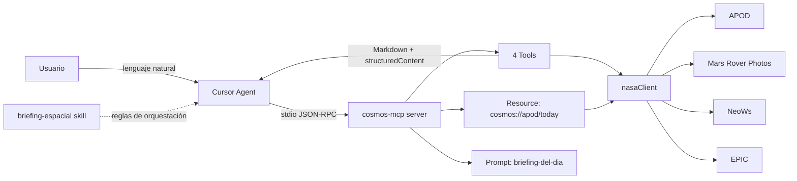

# Arquitectura — cosmos-mcp

## Flujo

1. El usuario escribe en Cursor en lenguaje natural.
2. El agente descubre las capacidades publicadas por MCP: tools, resources y prompts.
3. Si necesita datos dinámicos, elige una o más tools (`apod_por_fecha`, `fotos_marte`, `asteroides_cercanos`, `imagen_tierra`).
4. El server valida inputs con Zod y llama a `api.nasa.gov` vía `nasaClient`.
5. La respuesta incluye Markdown visual para el chat y `structuredContent` para consumidores programáticos.
6. La skill `briefing-espacial` orquesta APOD + NeoWs; el prompt MCP `briefing-del-dia` ofrece el mismo flujo como primitive portable del protocolo.

## Qué demuestra cada pieza

- **Tool:** el modelo puede ejecutar una operación externa tipada.
- **Resource:** el host puede leer un contenido conocido mediante una URI estable.
- **Prompt:** el servidor publica una plantilla reutilizable para el agente.
- **Skill:** Cursor aplica conocimiento de dominio y reglas editoriales a varias tools.
